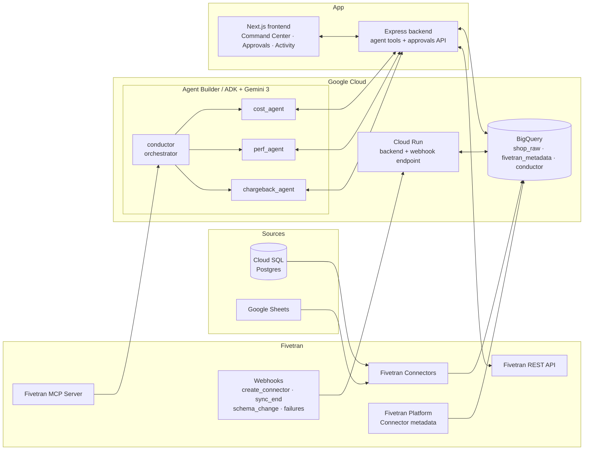

# Conductor — Autonomous Governance for Fivetran Pipelines

> **Google Cloud Rapid Agent Hackathon — Fivetran Track**
> A multi-agent system, built with **Gemini 3** and **Google Cloud Agent Builder (ADK)**, that audits, governs and *acts* on a real Fivetran fleet — with a human always in the loop.

**The problem: data pipelines have no control plane.** Anyone can create a connector and it starts syncing immediately. Schema changes propagate downstream with no review. Sync failures pile up unnoticed. Sync frequencies drift from what teams agreed to. Nobody owns the answer to "who is consuming what, and why?" The consequences are predictable: broken downstream models, silent data quality incidents, and runaway spend — cold tables syncing millions of rows nobody queries.

**Conductor is that missing control plane.** It doesn't just answer questions about your pipelines — it pauses connectors, blocks tables, changes sync frequencies, gates new data sources and reviews schema changes, all through the real Fivetran API, and never without human approval.

---

## What it does

| Capability | Description |
| --- | --- |
| 🤖 **Multi-agent fleet audit** | A conductor (orchestrator) agent delegates to three specialists — `cost_agent`, `perf_agent`, `chargeback_agent` — that analyze real MAR consumption, query activity, sync health and spend attribution. |
| � **Real-time connector gate** | A Fivetran webhook fires on `create_connector`. In **ENFORCE** mode, Conductor **pauses the new connector before its first sync**, applies a default policy and queues a review — nothing syncs until a human approves. |
| 🧬 **Schema change protection** | Per-connection toggle: when Fivetran reports a schema change on a protected connection, Conductor raises a `REVIEW_SCHEMA_CHANGE` approval so downstream consumers are never surprised. |
| 📋 **Policy engine** | Per-connection policies editable in the UI — MAR budget, minimum sync frequency, SLA tier, team owner, schema protection. Over-sync vs policy → the agent proposes a frequency change. |
| 🩺 **Sync health triage** | Consecutive sync failures detected from the Fivetran log → `perf_agent` autonomously proposes pausing the connector, citing real timestamps and failure reasons. `connection_failure` webhooks also raise alerts instantly. |
| 💸 **Cost waste detection** | Cross-references Fivetran MAR (via the Fivetran Platform Connector in BigQuery) against BigQuery `INFORMATION_SCHEMA` query logs to find **cold tables**: rows you pay to sync but never query. In the demo dataset: **335M MAR ≈ $3,567/month** of recoverable waste, priced at Fivetran's real rate. |
| 🧾 **Chargeback & spend explorer** | USD attribution per connection/team vs budget — CFO-ready, computed from actual MAR, with a dedicated spend view per table and connection. |
| ✅ **Human-in-the-loop approvals** | Every proposed action lands in an approval queue with the agent's reasoning, the exact payload that will execute, estimated savings, and the **full agent trace** (every handoff, tool call and thought) embedded in the decision card. |
| ↩️ **One-click rollback** | Every executed action is reversible against the live Fivetran API, with a full audit trail persisted in BigQuery. |
| 🚨 **Alerts & notifications** | Budget breaches, sync failures and gate events raise acknowledgeable alerts, stream live to the UI (SSE toasts), and can notify the owning team on Slack. |
| 🎛️ **OBSERVE / ENFORCE modes** | Choose governance posture per workspace: OBSERVE reviews without blocking; ENFORCE stops ungoverned changes before they run. |

## Architecture



**Flow:** Fivetran syncs operational data and its own metadata (MAR, logs) into BigQuery. The ADK multi-agent system — Gemini 3 reasoning over the **Fivetran MCP server** plus a custom tool layer — audits the fleet, simulates optimizations and files approval requests. Humans decide in the Conductor UI; approved actions execute against the live Fivetran API. The webhook → Cloud Run path gates new connectors, schema changes and failures in real time.

## Google Cloud & partner usage

- **Gemini 3 (`gemini-3.5-flash`)** — reasoning engine for all four agents.
- **Google Cloud Agent Builder / ADK (Python)** — multi-agent orchestration: `LlmAgent` hierarchy with `transfer_to_agent` handoffs, tool calling, and trace publication ([agent/conductor_operator/agent.py](agent/conductor_operator/agent.py)).
- **Fivetran (partner track)** — MCP server integration, Platform Connector (MAR + logs in BigQuery), REST API for executing actions (pause, block table/column, change frequency, reload schema), and account webhooks for the real-time gate, schema changes and failure alerts.
- **BigQuery** — single source of truth: synced data, Fivetran metadata, and Conductor's own state (actions, approvals, traces, policies, settings).
- **Cloud Run** — public webhook endpoint + deployed backend.
- **Cloud SQL (Postgres)** — realistic operational source (`shop_raw`) synced by Fivetran.

## Repository layout

```
agent/      ADK multi-agent system (Python, uv) — conductor + 3 specialists
backend/    Express backend — agent HTTP tools, approvals API, Fivetran client,
            BigQuery persistence, webhook handler (deployed to Cloud Run)
frontend/   Next.js Command Center — fleet overview, approvals with embedded
            agent traces, connector detail + policy editor, spend explorer,
            activity log with revert, live SSE updates
```

## Running it

### Prerequisites

- Node.js 22+, Python 3.12+ with [uv](https://docs.astral.sh/uv/), a GCP project with BigQuery, a Fivetran account (free trial works).

### 1. Backend

```bash
cd backend
npm install
# create .env: Fivetran API key/secret, BigQuery project, service account creds,
# GOOGLE_API_KEY (Gemini), MAR_USD_PER_MILLION, webhook secret
node src/server.js          # http://localhost:5000
```

### 2. Frontend

```bash
cd frontend
npm install
npm run dev                 # http://localhost:3000
```

### 3. Agent mission

```bash
cd agent
uv sync
uv run python smoke_agent.py "Run a full fleet audit: cost waste (cold tables, over-sync vs policy), sync health and failures, and a spend attribution report."
```

The mission produces pending approvals in the UI (`/approvals`), each with its agent trace. Approve one and watch the action execute against the real Fivetran API.

### 4. The gate (optional, needs a public endpoint)

Deploy the backend to Cloud Run, register a Fivetran account webhook for `create_connector`, set governance mode to **ENFORCE** in Settings — then create any connector in Fivetran and watch it get paused and queued for review before a single row syncs.

## Why it qualifies

- **Beyond chat**: the agent executes real actions (pause, block, reconfigure, gate, review schema changes) against a live SaaS API — under human oversight.
- **Multi-step missions**: one mission = orchestrator planning + 3 specialist agents + ~60 tool calls + approval requests, all traced end-to-end.
- **Partner power**: deep Fivetran integration — MCP server, Platform Connector metadata, REST API, and webhooks.
- **Built on Google Cloud**: Gemini 3 + Agent Builder (ADK) + BigQuery + Cloud Run.

## License

[MIT](LICENSE)
